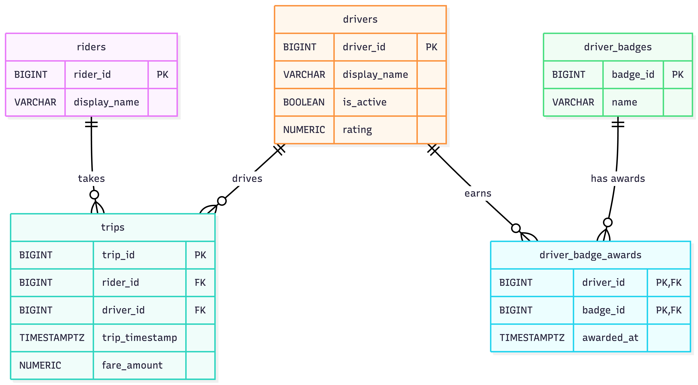

Ride Sharing Database

A PostgreSQL database for storing and analyzing ride-sharing data.

Theme: Ride Sharing

Domain

This setup covers the basics of a ride-sharing platform: riders, drivers, trips, badges, and the awards table that ties drivers to the badges they’ve earned. Riders take trips, drivers complete them, and each trip stores when it happened and what the fare was. Drivers also have a status and rating, and they can earn badges over time.

The whole point is to make the data easy to work with. I want to be able to ask simple questions without jumping through hoops. For example, things like how many trips a driver has completed, how much their fares add up to, which riders actually take trips, who’s active right now, and which badges a driver has earned. The schema should make those queries straightforward.

I used BIGINT surrogate keys for the main entities because names aren’t reliable primary keys. People can share names, and names can change. I also chose ON DELETE RESTRICT for the foreign keys because trips and badge awards are historical records that shouldn’t disappear just because a rider or driver is removed. The driver_badge_awards table uses a composite key on (driver_id, badge_id), which prevents the same badge from being awarded to the same driver twice.

ERD

The diagram below shows the five tables and how they relate. Riders connect to trips, drivers connect to trips, and drivers connect to badges through driver_badge_awards. I added awarded_at because the timing of a badge award can be useful when analyzing the data.

