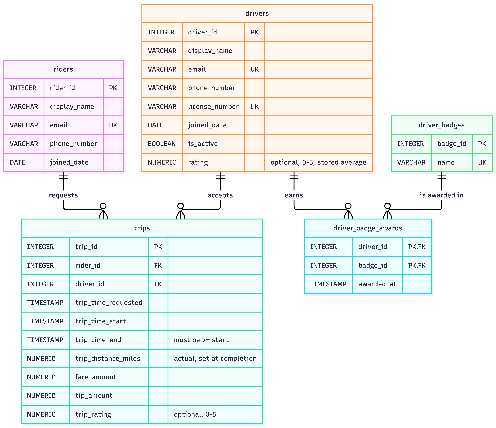

# Ride Sharing Database

A PostgreSQL database for storing and analyzing ride-sharing data: riders, drivers, trips, and the badges drivers earn.

**Theme:** Ride Sharing

## Domain

This database covers the basics of a ride-sharing platform: riders, drivers, trips, badges, and the awards table that ties drivers to the badges they've earned. Riders request trips and drivers accept them. Each trip records when it was requested, when it started and when it ended, plus the real distance, the fare, any tip, and an optional rating from the rider. Drivers also have an active status and a rating, and they can earn badges over time.

The whole point is to make the data easy to ask questions of. For example: how many trips has a driver completed, how much do their fares add up to, which riders actually take trips, who's active right now, how long do trips take, and which badges has a driver earned. The schema is built so those queries stay simple and don't need any hoops.

## Schema



The full DDL is in [`schema/schema.sql`](schema/schema.sql). Detailed attribute definitions are in [`schema/schema-definition.md`](schema/schema-definition.md), and every constraint with its reasoning is in [`schema/constraints.md`](schema/constraints.md). The diagram source is [`schema/erd.mmd`](schema/erd.mmd).

| Table | Role | Purpose |
|---|---|---|
| `riders` | actor | People who take trips |
| `drivers` | producer | People who complete trips; carry `is_active` and `rating` |
| `trips` | event | One row per trip: rider, driver, times, distance, fare, tip, rating |
| `driver_badges` | catalog | The badges that exist |
| `driver_badge_awards` | junction | Which driver earned which badge, and when |

**Design decisions to notice**

- **Surrogate keys:** every entity uses a generated integer key (`GENERATED ALWAYS AS IDENTITY`), because display names can be shared or changed and emails change too.
- **RESTRICT on every foreign key:** trips and awards are history. A rider, driver or badge with activity can't be hard-deleted, and `drivers.is_active` is how a driver gets taken offline. If someone wants their data removed, the plan is to anonymize their personal fields and keep the row.
- **Composite key on awards:** `(driver_id, badge_id)` stops the same badge being awarded to a driver twice. `awarded_at` sits on that table because it's about the pairing.
- **Rules live in the schema:** ratings must be 0 to 5, fares and tips can't be negative, and a trip can't start before it was requested or end before it started.
- **Derived stuff is computed, with one exception:** trip duration and all the counts and totals are worked out at query time. The only stored derived value is `drivers.rating`, which is a deliberate shortcut and is kept up to date by the application.
- **Indexes on foreign keys:** Postgres doesn't create these automatically, so `trips.rider_id`, `trips.driver_id` and `driver_badge_awards.badge_id` are indexed by hand.

The reasoning behind all of this is in [`analysis/unit2.md`](analysis/unit2.md).

## How to run it

You need PostgreSQL 14 or later and an empty database.

```bash
createdb ridesharing
psql -d ridesharing -f schema/schema.sql
psql -d ridesharing -c "\dt"
```

The script starts with a reset block, so you can run it again on the same database without cleaning anything up first.
